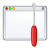
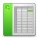
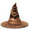
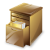
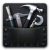

Liste des commandes
*******************

Commandes du menu Projet
========================

|nouveau| : création d'un projet pyLong vide (Ctrl + N)

.. |nouveau| image:: ./icones/nouveau.png
             :scale: 50%
             
|ouvrir| : ouverture d'un projet pyLong existant (Ctrl + O)

.. |ouvrir| image:: ./icones/ouvrir.png
            :scale: 50%
             
|enregistrer| : enregistrement du projet courant (Ctrl + S)

.. |enregistrer| image:: ./icones/enregistrer.png
                 :scale: 50%
             
|enregistrer_sous| : enregistrement du projet courant à un autre emplacement (Ctrl + Shift + S)

.. |enregistrer_sous| image:: ./icones/enregistrer_sous.png
                      :scale: 50%
             
|preferences| : ouvre la boîte de dialogue des préférences du projet

.. |preferences| image:: ./icones/preferences.png
                 :scale: 50%             

Commandes du menu Interface
===========================

|plein_ecran| : activation/désactivation du mode plein écran (F11)

.. |plein_ecran| image:: ./icones/plein_ecran.png
                 :scale: 50%

|agrandir_canvas| : agrandissement de la taille du canvas (Ctrl + +)

.. |agrandir_canvas| image:: ./icones/agrandir_canvas.png
                     :scale: 50%
                     
|retrecir_canvas| : rétrécissement de la taille du canvas (Ctrl + -)

.. |retrecir_canvas| image:: ./icones/retrecir_canvas.png
                     :scale: 50%   
                     
|ajuster_canvas_largeur| : ajustement du canvas sur toute sa largeur

.. |ajuster_canvas_largeur| image:: ./icones/ajuster_canvas_largeur.png
                            :scale: 50%
                     
|ajuster_canvas_hauteur| : ajustement du canvas sur toute sa hauteur

.. |ajuster_canvas_hauteur| image:: ./icones/ajuster_canvas_hauteur.png
                            :scale: 50%                    
                            
Commandes du menu Figure
========================

|mise_en_page| : ouverture de la boîte de dialogue de mise en page

                 
|mise_en_page_avancee| : ouverture de la boîte de dialogue de mise en page avancée

                          
|rafraichir| : rafraichissement de  la figure (Ctrl + R)

                
|deplacer| : activation/désactivation du mode déplacement

                
|zoomer| : activation/désactivation du mode zoom

                
|exporter_figure| : ouverture de la boîte de dialogue d'exportation de la figure (Ctrl + P)

                     
|copier_figure| : copie de la figure courante vers le presse-papier (Ctrl + C)

                   
Commandes du menu Subplot
=========================

|subplots| : ouverture de la boîte de dialogue de gestion des subplots

Commandes du menu Profil en long
================================

|ajouter| : ouverture de la boîte de dialogue d'ajout de profil en long

.. |ajouter| image:: ./icones/ajouter.png
             :scale: 50%  
             
|tableau| : ouverture de la boîte de dialogue du tableau des valeurs du profil

|style| : ouverture de la boîte de dialogue des propriétés graphiques du profil

.. |style| image:: ./icones/style.png
           :scale: 50% 
           
|trier| : ouverture de la boîte de dialogue de tri du profil

           
|filtrer| : ouverture de la boîte de dialogue de filtrage du profil

             
|simplifier| : ouverture de la boîte de dialogue de simplification automatisée du profil

|exporter| : ouverture de la boîte de dialogue d'exportation du profil

              
|supprimer| : suppression des profils (Alt + P)

Commandes du menu Edition interactive
=====================================

|editer| : activation/désactivation du mode édition interactive du profil

            
|ajouter_sommet| : activation/désactivation de l'ajout de sommet (Shift + A)

                    
|supprimer_sommet| : activation/désactivation de la suppression de sommet (Shift + S)

                      
|magnetisme| : activation/désactivation de l'interpolation sur profil

Commandes du menu Annotation
============================

|texte| : ajout d'un texte

           
|annotation_ponctuelle| : ajout d'une annotation ponctuelle

                           
|annotation_lineaire| : ajout d'une annotation linéaire

                         
|zone| : ajout d'une zone

          
|rectangle| : ajout d'un rectangle

               
|style| : ouverture de la boîte de dialogue des propriétés graphiques de l'annotation

.. |style| image:: ./icones/style.png
           :scale: 50%
           
|copier_style| : copie du style graphique de l'annotation (Ctrl + Alt + C)

                  
|coller_style| : application du style graphique aux annotations (Ctrl + Alt + V)

.. |coller_style| image:: ./icones/coller_style.png
                  :scale: 50% 
                  
|ajuster_annotations| : ouverture de la boîte de dialogue d'ajustement des annotations ponctuelles (Ctrl + Alt + Z)

             
|dupliquer| : duplique les annotations (Ctrl + Alt + D)

               
|groupes| : ouverture de la boîte de dialogue de gestion des groupes d'annotations

             
|supprimer| : suppression des annotations (Alt + A)

Commandes du menu Ligne de rappel
=================================

|creation_ligne_rappel| : création de lignes de rappel à partir des annotations

                           
|gestion_ligne_rappel| : ouverture de la boîte de dialogue de gestion des lignes de rappel

Commandes du menu Toolbox
=========================

|toolbox| : ouverture de la toolbox

             
|supprimer| : suppression des calculs (Alt + C)

Commandes du menu Autres données
================================

|ajouter_donnee| : ouverture de la boîte de dialogue d'ajout de données

             
|style| : ouverture de la boîte de dialogue des propriétés graphiques des données

.. |style| image:: ./icones/style.png
           :scale: 50%
             
|supprimer| : suppression des données (Alt + D)

Commandes du menu Ressources
============================

|aide| : ouverture de la documentation en ligne

             
|propos| : ouverture de la boîte de dialogue des "À propos de pyLong"

