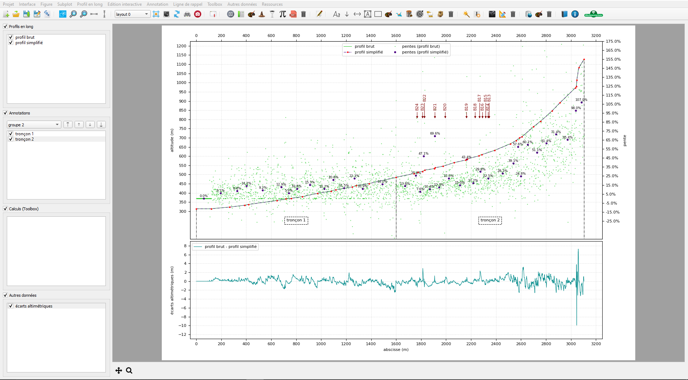

Introduction
************

.. image:: ./icones/introduction.png
   :align: center
   :scale: 75%

pyLong, quésaco ?
=================

**pyLong** est un logiciel de visualisation, d'édition, d'analyse et de traitement de profils en long. Il a été pensé et conçu pour répondre à des besoins liés aux domaines de l'hydraulique torrentielle et des chutes de blocs en milieu montagneux.

   
   Aperçu du logiciel pyLong.
