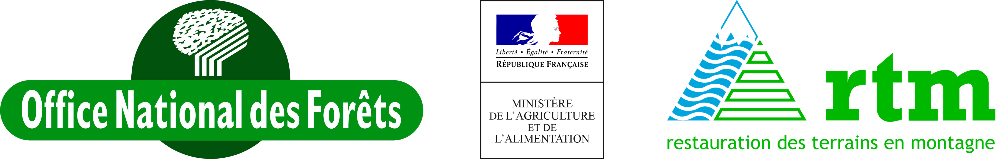

Introduction
************

pyLong, quésaco ?
=================

**pyLong** est un logiciel de visualisation, d'édition, d'analyse et de traitement de profils en long **développé par les Services de Restauration de Terrains en Montagne de l'Office National des Forêts** (`ONF-RTM`_) **et financé par le Minstère de l'Agriculture et de l'Alimentation** (`MAA`_). Il a été pensé et conçu pour répondre à des besoins liés aux domaines de l'hydraulique torrentielle et des chutes de blocs en milieu montagneux. 

|

   
|

.. _`ONF-RTM`: https://www.onf.fr/
.. _`MAA`: https://agriculture.gouv.fr/

.. figure:: ./captures/apercu.png
   :align: center
   :scale: 25%
   
   Aperçu du logiciel pyLong.
   
**pyLong** facilite l'interprétation de profils en long générés à partir de modèles numériques de terrain à haute résolution (issus de levés LiDaR notamment). Ces profils comportent en effet plusieurs milliers de points, ce qui rend impossible une interprétation géoémorphologique basée sur l'évolution de la pente longitudinale. 

**pyLong** permet une simplification automatisée et/ou interactive des profils en long et le calcul des pentes longitudinales sur des tronçons homogènes d'un point de vue géomorphologique. 

Les principales fonctionnalités du logiciel **pyLong** sont:

- **Simplification automatisée du profil en long** avec l'algorithme de `Visvalingam & Whyatt`_
- **Simplification interactive du profil en long** avec ajout ou suppression de points directement sur le graphique
- Filtrage du profil en long avec différents algorithmes de traitement du signal (Butterworth, Lowess, Savitzky-Golay)
- Calcul des pentes longitudinales
- **Tracé facilité de multiples séries de profils en long et d'annotations**
- Fonctionnalités étendues d'affichage et de gestion du rendu graphique : mises en page multiples, ajout de subplots permettant de visualiser d'autres données liées au profil en long (écarts altimétriques, comparaison diachronique, variations de la largeur du lit, etc.)
- **Toolbox de modèles 1D empiriques de propagation de laves torrentielles et de chutes de blocs**. 
- Export de la figure graphique dans divers formats pour insertion dans des documents d'étude et/ou publications scientifiques.
   
.. _`Visvalingam & Whyatt`: https://en.wikipedia.org/wiki/Visvalingam%E2%80%93Whyatt_algorithm
   

À qui s'adresse pyLong ?
========================

**pyLong** a été créé pour des besoins opérationnels par des ingénieurs pour des ingénieurs. Il peut être utilisé par des bureaux d'études, des maitres d'ouvrages, des chercheurs, etc.

Comment citer pyLong
====================

.. note::
   ONF-RTM. (2022). pyLong (22.01) [Logiciel de visualisation, d’analyse et de traitement de profil en long]. https://pylong-doc.readthedocs.io/fr/latest/
   
La petite histoire de pyLong
============================

Une première version basée sur des bibliothèques de calcul **Python** et interfacée avec Microsoft Excel a vu le jour en 2018. Une version logicielle de **pyLong** a été développée en 2020 pour faciliter son usage et sa diffusion en interne aux services ONF-RTM, mais aussi dans l'objectif d'une diffusion en externe auprès des partenaires intéressés (collectivités Gémapiennes, bureaux d'études, instituts de recherche, etc.). Celle-ci inclut des développements spécifiques non présents dans la version initiale (Toolbox, fonctionnalités étendues d'affichage, etc.).

A ce jour, seule la version logicielle de **pyLong** est maintenue.

Contributeurs
=============

- Damien Kuss : création de l'outil pyLong pour Excel: tri, filtrage &simplification d'un profil en long, modèles 1D empiriques de propagation de laves torrentielles (Flow-R, Rickenmann, Corominas)
- Pierre Dupire & Romain Paulhe: aide au développement de l'outil *Ligne d'énergie*
- Bruno Demolis, Perrine Freydier & Olivier Newinger: retours d'expérience
- Rémy Martin: aide au développement de l'outil *Lignes d'énergie (MEZAP)*
