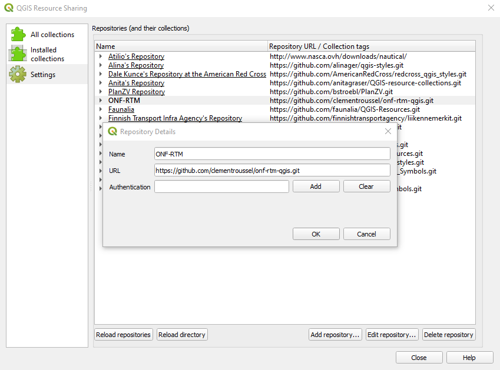
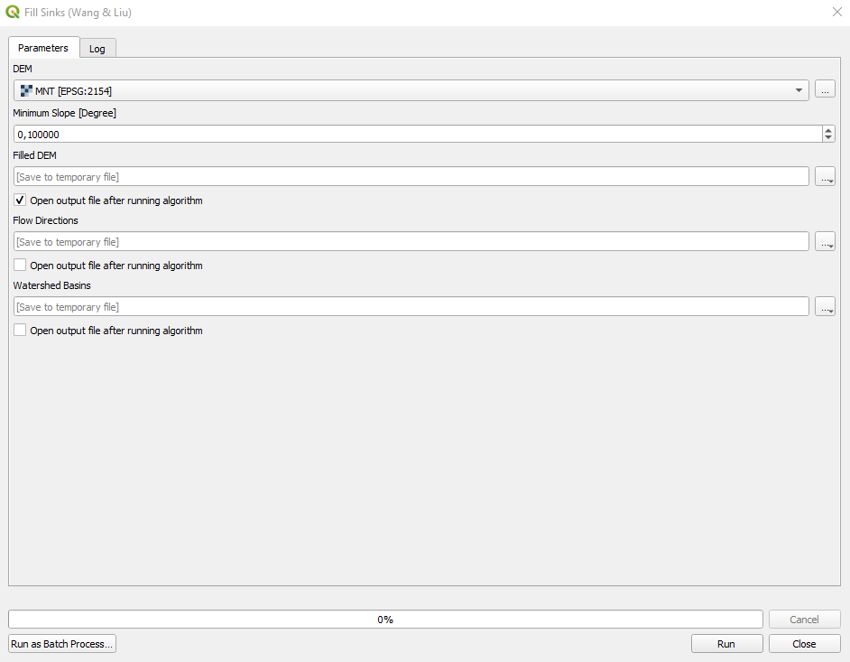
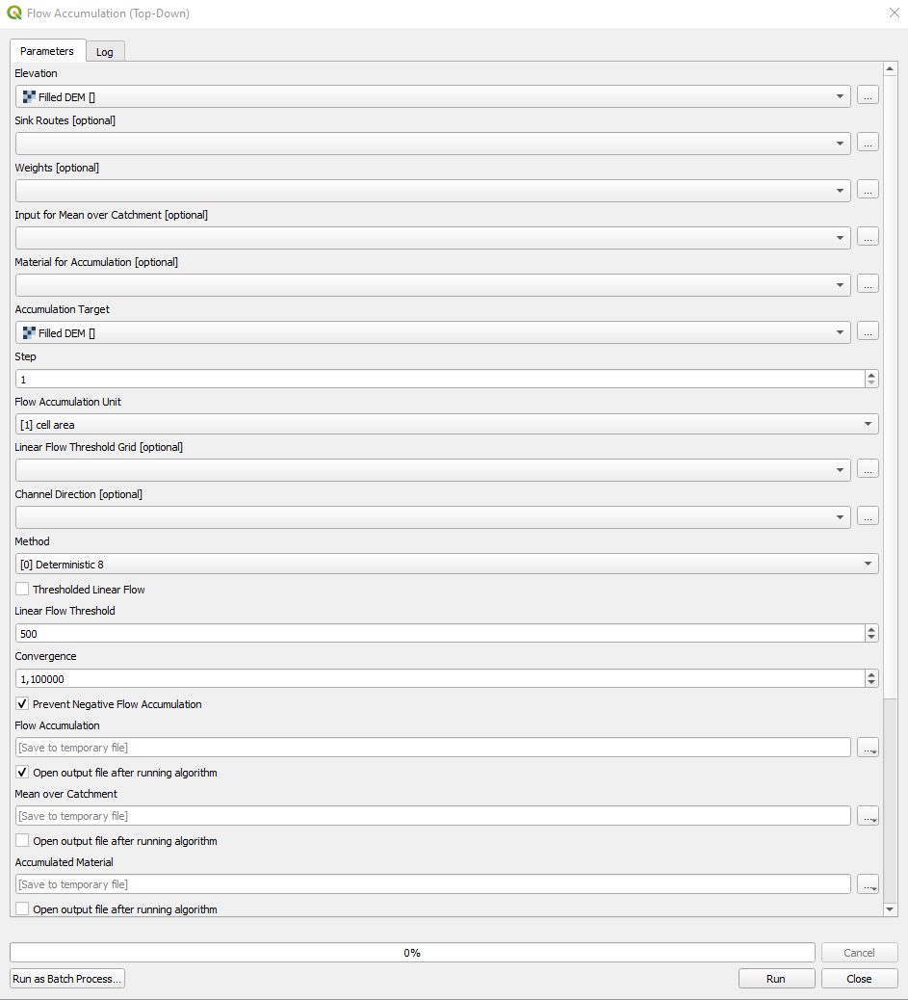
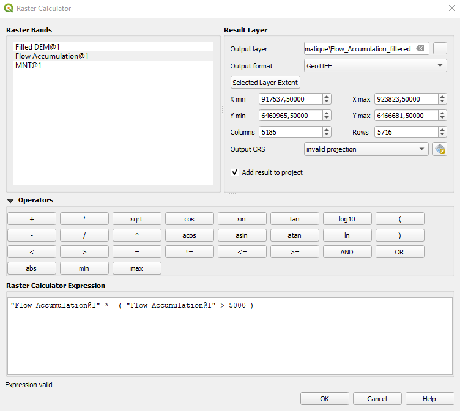
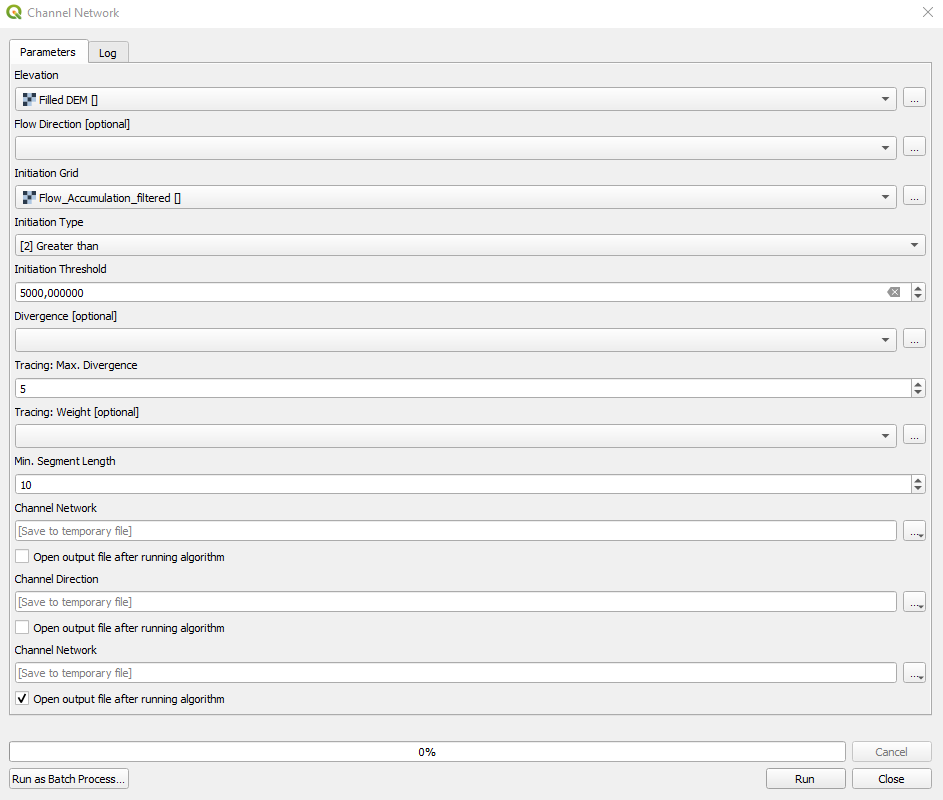

Profils en long - généralités et méthodes
*****************************************

Définitions
===========

Point de vue hydromorphologique
^^^^^^^^^^^^^^^^^^^^^^^^^^^^^^^

    Le profil en long d’un cours d’eau est une représentation graphique qui met en rapport la cote du fond du lit et/ou de la ligne d’eau et/ou du niveau des berges (en ordonnées), et 
    la distance (en abscisses). Il peut être réalisé à différentes échelles du cours d’eau (linéaire complet, tronçons, stations) et permet d’observer les variations longitudinales de 
    la pente du fond du lit et/ou de la ligne d’eau et/ou du niveau des berges. 
    
    C’est un outil hydromorphologique essentiel qui traduit, par la comparaison diachronique de plusieurs relevés, les processus physiques verticaux d’ajustement (érosion/dépôt), 
    sous l’effet notamment des variations de débits liquide et solide (variables de contrôle primaires). Plus localement, la pente et la géométrie de la vallée, la granulométrie du lit 
    et la végétation rivulaire (variables de contrôle secondaires) influencent aussi la forme du profil longitudinal. 

    (source : https://professionnels.ofb.fr/ - Guide pour l'élaboration de suivis d'opérations de restauration hydromorphologique en cours d'eau - Mai 2019)

Méthodes de génération d'un profil en long
==========================================

.. note::
   - les méthodes de génération d'un profil en long présentées ci-dessous utlisent le logiciel QGIS 3.16.16 avec SAGA 7.8.2
   - les scripts *Polyline Projection* et *Cross Profiles* s'installent de la manière suivante:
       * installer l'extension (plugin) *QGIS Resource Sharing*
       * ajouter le dépôt *ONF-RTM* avec l'url: https://github.com/clementroussel/onf-rtm-qgis.git

   
   *QGIS Resource Sharing*

Utilisation de la BD TOPO® de l'IGN
^^^^^^^^^^^^^^^^^^^^^^^^^^^^^^^^^^^

La BD TOPO® de l'IGN possède une couche nommée *TRONCON_HYDROGRAPHIQUE*, classée dans la thématique *HYDROGRAPHIE*, qu'il est possible d'exploiter pour
construire un profil en long.

1. Téléchargement de la BD TOPO® depuis le portail https://geoservices.ign.fr/bdtopo
2. Chargement de la couche *TRONCON_HYDROGRAPHIQUE* dans QGIS
3. Sélection manuelle des tronçons d'intérêt
4. Enregistrement de la sélection dans une nouvelle couche
5. Regroupement des tronçons (*regrouper* / *dissolve*)
6. Suppression de tous les champs de la table attributaire (*supprimer champ(s)* / *drop fields*)
7. Ajout d'un champ auto-incrémenté "Id" (*ajouter un champ auto-incrémenté* / "add autoincrement field*)
8. [Inversion de la géométrie] (*inverser la direction des lignes* / *reverse line direction*)
9. Utilisation du script *Polyline Projection*

**Avantages:**

- Rapidité - simplicité
- Aucun MNT requis car la donnée altimétrique est contenue dans les entités de la couche *TRONCON_HYDROGRAPHIQUE*

**Inconvénients:**

- Origine, qualité des données altimétriques de la couche *TRONCON_HYDROGRAPHIQUE*

Utilisation des courbes de niveaux
^^^^^^^^^^^^^^^^^^^^^^^^^^^^^^^^^^

On utilise ici un Modèle Numérique de Terrain (MNT) pour générer les courbes de niveaux sur lesquelles le tracé en plan sera construit.

1. Chargement d'un MNT
2. Génération des courbes de niveau
3. Création d'une nouvelle couche vectorielle, de type polyligne
4. Construction du tracé en plan par numérisation manuelle
5. [Inversion de la géométrie] (*inverser la direction des lignes* / *reverse line direction*)
6. Génération du profil en long (avec/sans interpolation)

    * Génération du profil en long avec le plugin *Profile Tool (Terrain profile)*
    * Génération du profil en long avec le script *Polyline Projection*

**Avantages:**

- Choix des points constitutifs du tracé en plan

**Inconvénients:**

- Chronophage sur des grands linéaires
- Génération possible de contre-pentes

Utilisation de profils en travers
^^^^^^^^^^^^^^^^^^^^^^^^^^^^^^^^^

On utilise ici un Modèle Numérique de Terrain (MNT) couplé à des tabulations (ou profils en tavers) régulièrement espacés sur le tracé en plan.

1. Chargement d'un MNT
2. Construction d'un axe en plan
3. [Inversion de la géométrie] (*inverser la direction des lignes* / *reverse line direction*)
4. Génération des tabulations avec le script *Cross Profiles*

**Avantages:**

- Rapidité

**Inconvénients:**

- Génération possible de contre-pentes (par croisement des tabulations)

Utilisation des algorithmes de la librairie SAGA
^^^^^^^^^^^^^^^^^^^^^^^^^^^^^^^^^^^^^^^^^^^^^^^^

On tire ici profit des algorithmes de la librairie SAGA pour générer un profil en long de manière semi-automatique.

1. Chargement d'un MNT
2. Remplissage du MNT : cette commande essentielle a pour objectif de remplir les dépressions du MNT (*SAGA > Terrain Analysis – Hydrology > Fill sinks*)

   
   *Fill sinks (Wang & Liu)*

3. Calcul des superficies de bassins versants (BV) : cette commande calcule pour chaque pixel du MNT la superficie du BV en amont du pixel (*SAGA > Terrain Analysis – Hydrology > Flow Accumulation (Top-Down)*)

   
   *Flow Accumulation (Top-Down)*

4. Filtrage des superficies de BV : on conserve uniquement les pixels dont la superficie est supérieure à un certain seuil. Cela facilite l'affichage et diminue les temps de calculs des prochaines étapes (*Calculatrice Raster* / *Raster Calculator*)

   
   *Raster Calculator*

5. Calcul du réseau hydrographique : cette commande permet de générer le réseau hydrographique sous forme vectorielle (*SAGA > Terrain Analysis – Channels > Channel network*)

   
   *Channel Network*

6. Sélection manuelle des tronçons d'intérêt
7. Enregistrement de la sélection dans une nouvelle couche
8. Regroupement des tronçons (*regrouper* / *dissolve*)
9. [Inversion de la géométrie] (*inverser la direction des lignes* / *reverse line direction*)
10. [Simplification du tracé en plan] (*simplifier* / *simplify*)
11. Génération du profil en long (avec/sans interpolation)

    * Génération du profil en long avec le plugin *Profile Tool (Terrain profile)*
    * Génération du profil en long avec le script *Polyline Projection*

**Avantages:**

- Exploite la résolution du MNT

**Inconvénients:**

- Temps de calculs

Projection sur un axe de référence
----------------------------------

Projection d'une entité linéaire
^^^^^^^^^^^^^^^^^^^^^^^^^^^^^^^^

Projection d'entités ponctuelles
^^^^^^^^^^^^^^^^^^^^^^^^^^^^^^^^

