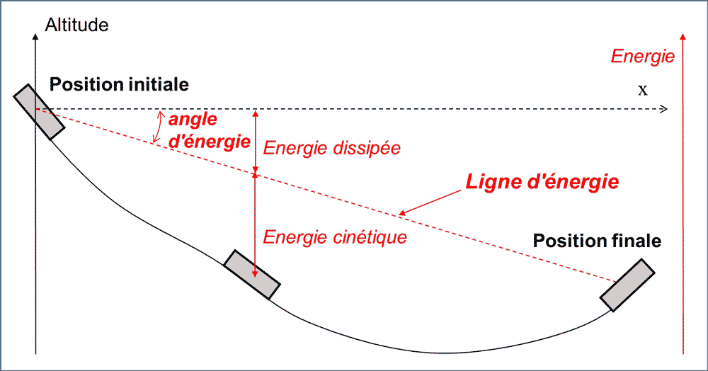
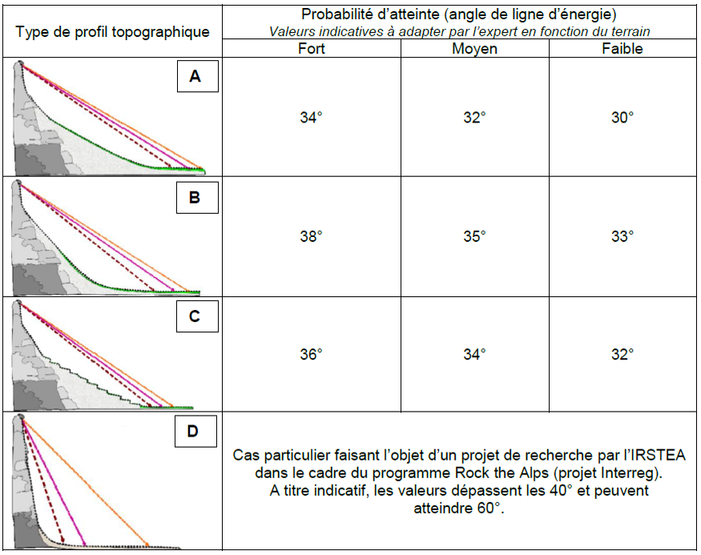

Ligne d'énergie
===============

   
|

Principe de la ligne d'énergie
------------------------------

Diverses approches mécaniques permettent d’estimer la distance de propagation des mouvements rocheux.  La première est basée sur l’angle d’énergie, qui quantifie la perte d’énergie au cours de la propagation du mouvement. Lorsque la masse en mouvement s’arrête, son énergie potentielle est moins élevée qu’avant le mouvement; dans un profil du versant, le point d’arrêt peut être obtenu en traçant une ligne (ligne d’énergie) issue de la zone de départ du mouvement et d’inclinaison égale à l’angle d’énergie.
L’énergie dissipée est due essentiellement aux rebonds, qui ne sont pas parfaitement élastiques, à la fragmentation des blocs, à l’émission d’ondes sismiques et éventuellement à la destruction des arbres. [Ref]_

.. [Ref] FABRE Denis, HANTZ Didier (2020), Glissements et éboulements rocheux, une fatalité ?, Encyclopédie de l’Environnement, [en ligne ISSN 2555-0950] url : https://www.encyclopedie-environnement.org/sol/glissement-eboulement-rocheux-fatalite/

Probabilités d'atteinte selon le guide MEZAP (version janvier 2014)
^^^^^^^^^^^^^^^^^^^^^^^^^^^^^^^^^^^^^^^^^^^^^^^^^^^^^^^^^^^^^^^^^^^

Calcul de lignes d'énergie avec pyLong
--------------------------------------

Méthode : départ + arrivée
^^^^^^^^^^^^^^^^^^^^^^^^^^

- Les abscisses de **départ** et **d'arrivée** doivent être renseignées;
- Si le calcul réussi, les valeurs d'altitudes et d'angle sont mises à jour.

Méthode : départ + angle
^^^^^^^^^^^^^^^^^^^^^^^^

- L'abscisse de **départ** et **l'angle** doivent être renseignés;
- Si le calcul réussi, les valeurs de position du point d'arrivée et d'altitude du point de départ sont mises à jour.

Méthode : arrivée + angle
^^^^^^^^^^^^^^^^^^^^^^^^^

- L'abscisse **d'arrivée** et **l'angle** doivent être renseignés;
- Si le calcul réussi, les valeurs de position du point de départ et d'altitude du point d'arrivée sont mises à jour.

.. note::
   - la notion de **départ** correspond au point de plus haute altitude;
   - la notion **d'arrivée** correspond au point de plus basse altitude.
   
